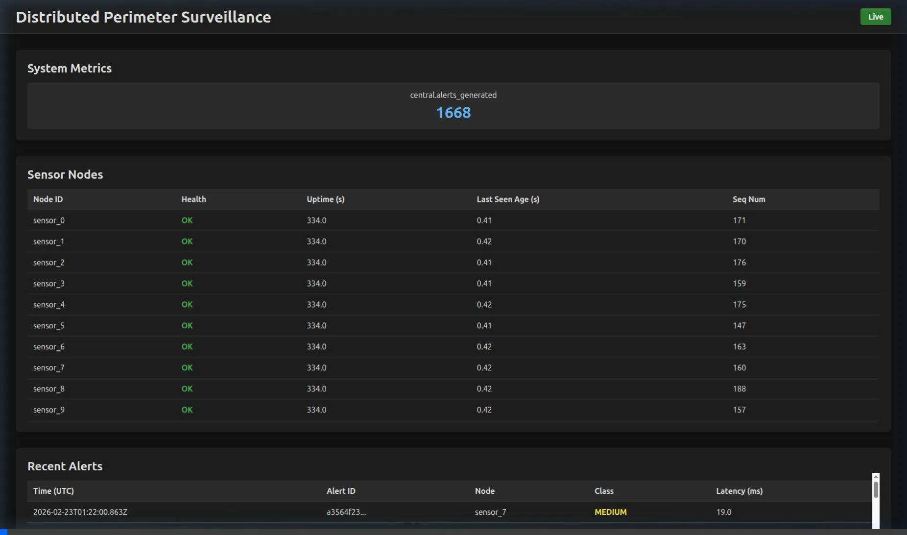

# Distributed Sensor Surveillance System (Simulated, Non-Weapon)

> **Target:** Demonstrate **Advanced systems engineering** and **production-style C++20** (interfaces, determinism, V-model verification).

---

## 0. Non-Claims and Boundaries

This project is a **simulation** of a perimeter surveillance subsystem inspired by distributed sensing concepts. It does **not** claim operational performance.

**Out of scope (explicit):**

- Weapon integration, targeting, or fire control
- Classified sensing methods or performance
- Real deployment, safety certification, or cyber hardening beyond basic hygiene

The project’s purpose is to demonstrate **requirements engineering, interface control, verification, traceability, and disciplined C++ implementation**.

---

## 1. Project Overview & Architecture

This project implements a highly structured, scalable software simulation of a perimeter defense network. It simulates multiple field sensors connected via an impaired communication link to a central processor, which aggregates the information to issue real-time defensive alerts to a user interface. 

The system leverages:
* **ZeroMQ**: For efficient asynchronous messaging (`PUB/SUB`).
* **C++20**: Utilizing standard parallelism and highly deterministic behavior.
* **CMake & CTest**: For building components and automated verification (V-model testing).
* **React/Vanilla JS via HTTP**: The `operator_ui` provides web-based dashboarding, reading the JSON state of the core `central_processor`.

### High-Level Components

The system consists of four distinct distributed processes interconnected via ZeroMQ over local TCP, with HTTP REST interfaces for the UI:

1. **`sensor_node`**: Multiple instances acting as physical field sensors. They generate fake "seismic" or "acoustic" events (e.g. DIGGING, VEHICLE, WALKING, WIND) using Poisson distributions.
2. **`network_emulator`**: A middleman node that intercepts all traffic between the sensors and the central hub, introducing arbitrary latency, jitter, and packet loss based on a configuration file.
3. **`central_processor`**: The hub. It aggregates telemetry and calculates the real-time processing latency. It classifies events into `LOW`, `MEDIUM`, or `HIGH` threat alerts.
4. **`operator_ui`**: An HTTP server reading local central state to serve the live frontend web dashboard.

---

## 2. Operator UI Dashboard

The `operator_ui` exposes a live web interface visually demonstrating the telemetry tracking, node survivability, and metrics generation. 



---

## 3. Getting Started

### Prerequisites
- A **C++20** compiler (GCC, Clang, or MSVC)
- **CMake $\ge$ 3.24**
- **Git** and standard build tools (`ninja-build` or `make`)
- **Linux** (Tested on Ubuntu)

Dependencies are strictly managed locally via `vcpkg` using manifest mode. The `vcpkg` script is automatically invoked by CMake, given `VCPKG_ROOT`.

### Building the System

Configure and build using the provided CMake Presets. This will compile all four separate component binaries and the associated test applications.

```bash
mkdir -p build/release
# Configure the build system (pulls dependencies via vcpkg automatically)
cmake --preset release 

# Build the binaries
cmake --build --preset release
```

---

## 4. Execution & Testing

### Running the V-Model Test Suite (CTest)

The project includes strict requirements testing mapped to an SRS (Software Requirements Specification) document. These tests run the physical binaries independently, monitoring them for fault tolerance, deterministic reproducibility, and latency requirements.

```bash
cd build/release
ctest --output-on-failure
```

* **`TC-LAT-001`**: End-to-end event to central latency profiling.
* **`TC-FT-001`**: Fault tolerance under rolling sensor deaths.
* **`TC-DET-001`**: Seed-based deterministic reproducibility proving bit-for-bit system isolation.
* **`TC-LOG-001`**: Log tracing and structural verification.

---

### Running the Live Cluster

To interact with the live Operator UI and view the system in action, use the provided bash script to launch the full 13-process cluster locally:

```bash
# Set execute permissions on the script if not already set
chmod +x scripts/run_cluster.sh

# Run the cluster
./scripts/run_cluster.sh
```

Once you see the cluster outputting logs in the terminal, open your web browser and navigate to:
**`http://127.0.0.1:8080/`**

To cleanly shut down all connected processes, simply press `Ctrl+C` in the terminal.
